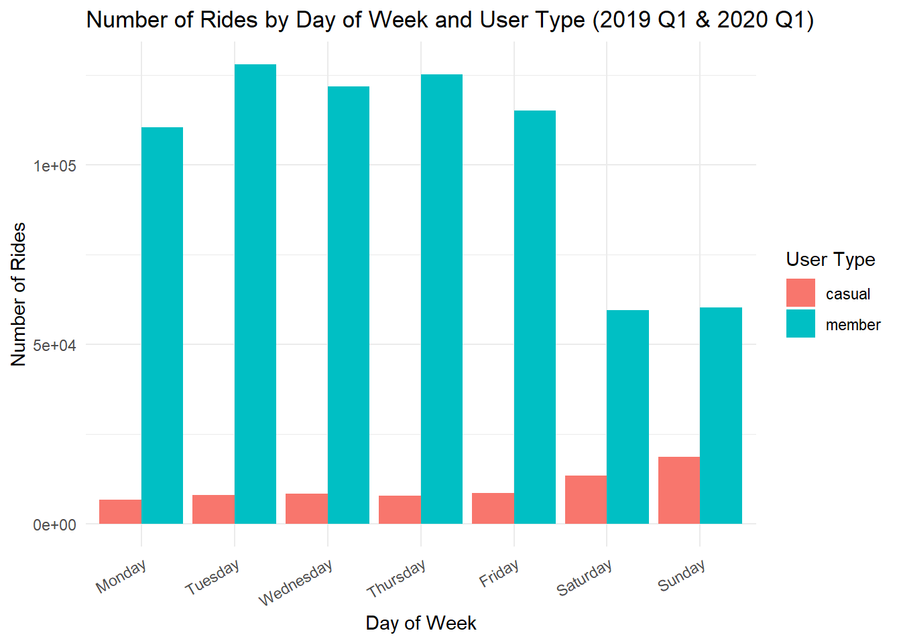
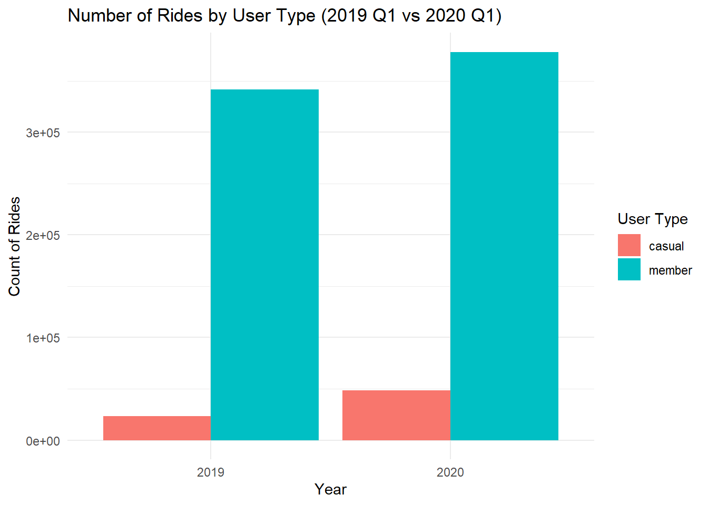

# Divvy Bike Case Study (2019 Q1 vs 2020 Q1)

## 1. Project Overview
This case study analyzes bike usage patterns using data from Divvy, a bike-sharing service in Chicago. The data comes from 2019 Q1 and 2020 Q1 datasets provided by Motivate International Inc.  

## 2. Business Task

The primary business task is to:
> **Understand how member users and casual users use Divvy bikes differently in terms of ride duration and temporal patterns (weekday vs. weekend), in order to support data-driven marketing and product strategies.**
 
### Key Stakeholders
- The director of marketing and the Cyclistic marketing analytics team
- Cyclistic executive team

## 3. Data Sources

The data used in this case study are from **publicly available Divvy bike trip datasets**, provided by **Motivate International Inc.**, a major bike-sharing operator.
The data is open and anonymized.

### Datasets
- `Divvy_Trips_2019_Q1.csv`
- `Divvy_Trips_2020_Q1.csv`

These datasets include trip-level information such as:
- Start and end times and dates
- User type (member or casual)
- Station information

## 4. Data Cleaning and Preparation

a. Inspect Data and Handling Missing Values
- Some variables (e.g., gender and birth year) were missing in the 2020 dataset and set to `NA`.
- Records with incomplete or invalid start or end times were removed.

b. Column Alignment and Merging
- The 2019 and 2020 datasets used different column names.
- Columns were renamed and reordered to ensure consistency.
- The two datasets were then merged into a single table.

c. Ride Length Calculation
- Ride duration was converted into minutes (`ride_length_min`) for consistency and easier interpretation.

d. Outlier Removal
- Trips longer than **24 hours (1440 minutes)** were considered abnormal.
- For example, one record showed a duration of over **10 million seconds (≈123 days)**, which does not reflect real riding behavior.
- These extreme values were removed to avoid skewing the analysis.

e. User Type Standardization
- Values for user type were unified to `member` and `casual` to maintain consistency across both datasets.

## 5. Descriptive Analysis and Visualization

### 5.1 Overall Ride Characteristics

| Measure                          | Value      |
|----------------------------------|-----------|
| Mean ride length (min)           | 13.66      |
| Max ride length (min)            | 1435.92    |
| Most common day of week          | Tuesday    |

**Insights:**  
- The average ride length across all users is approximately 13.7 minutes.  
- The maximum valid ride length is just under 24 hours, after outlier removal.  
- Tuesday is the most common day for bike usage overall.

### 5.2 Ride Patterns by User Type

| User Type | Mean (min) | Max (min) | Count   | Mode Day |
|-----------|------------|-----------|---------|----------|
| Casual    | 36.36      | 1435.92   | 71348   | 7        |
| Member    | 11.41      | 1433.07   | 720126  | 2        |

### Figure 1. 

 

**Insights:**  
- Casual users take longer rides, especially on weekends.  
- Member users ride more frequently but for shorter durations, mainly on weekdays.

### 5.3 Ride Patterns by Weekday

| User Type | Day of Week | Count  |
|-----------|------------|--------|
| Casual    | Monday     | 6725   |
| Casual    | Tuesday    | 7969   |
| Casual    | Wednesday  | 8387   |
| Casual    | Thursday   | 7773   |
| Casual    | Friday     | 8500   |
| Casual    | Saturday   | 13416  |
| Casual    | Sunday     | 18578  |
| Member    | Monday     | 110412 |
| Member    | Tuesday    | 127946 |
| Member    | Wednesday  | 121879 |
| Member    | Thursday   | 125198 |
| Member    | Friday     | 115132 |
| Member    | Saturday   | 59381  |
| Member    | Sunday     | 60178  |

### Figure 2. 

### Figure 3. 

**Insights:**  
- Members ride mostly on weekdays.  
- Casual users ride more on weekends, peaking on Sunday. However, even at their peak, their ride counts are still roughly half of those of member users.
- Casual users ride longer on all days.

### 5.4 Comparison Across Years (2019 vs. 2020 Q1)

| Year | User Type | Mean (min) | Max (min) | Count  | Mode Day |
|------|-----------|------------|-----------|--------|----------|
| 2019 | Casual    | 35.3       | 1410      | 23095  | 6        |
| 2019 | Member    | 11.3       | 1433      | 341782 | 4        |
| 2020 | Casual    | 36.9       | 1436      | 48253  | 7        |
| 2020 | Member    | 11.5       | 1432      | 378344 | 2        |

### Figure 4. 

### Figure 5. 

**Insights:**  
- The number of rides for both types of users has increased in 2020.
- Casual users consistently ride longer than members across both years.  
- Member usage volume is much higher than casual usage.  

## 6. Key Insights

- Member users use bikes frequently and for short trips.  
- Casual users prefer longer rides, which are likely to be leisure-oriented, especially on weekends.  
- Weekday and weekend patterns clearly separate the two user groups.

## 7. Recommendations

- It would be useful to target casual users with weekend-focused membership promotions.
- Based on the weekday bike-use data, we could design commuter-oriented benefits for members.

## 8. Tools Used

- **Google Sheets**, **R**, **ggplot2**, **dplyr**, **R Markdown**  
- **GitHub** for portfolio presentation
