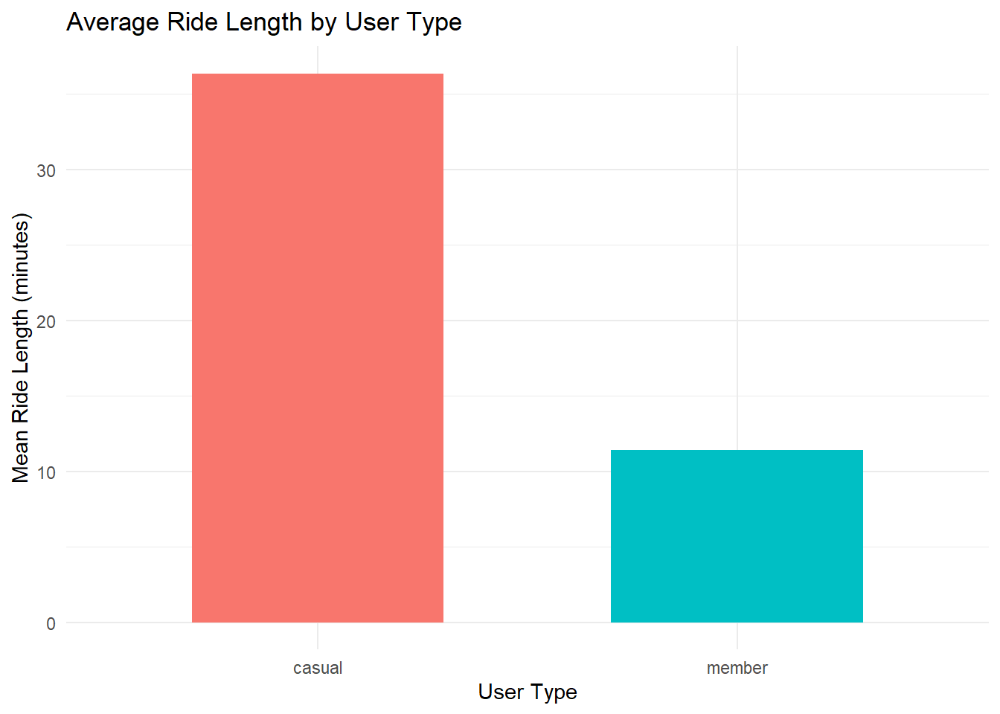
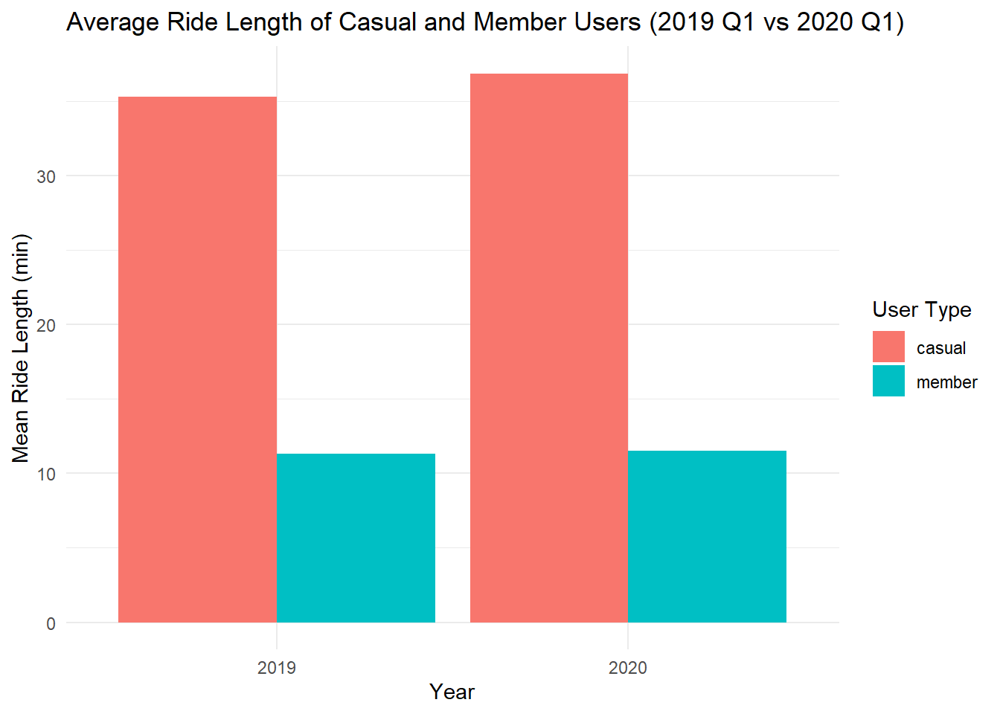
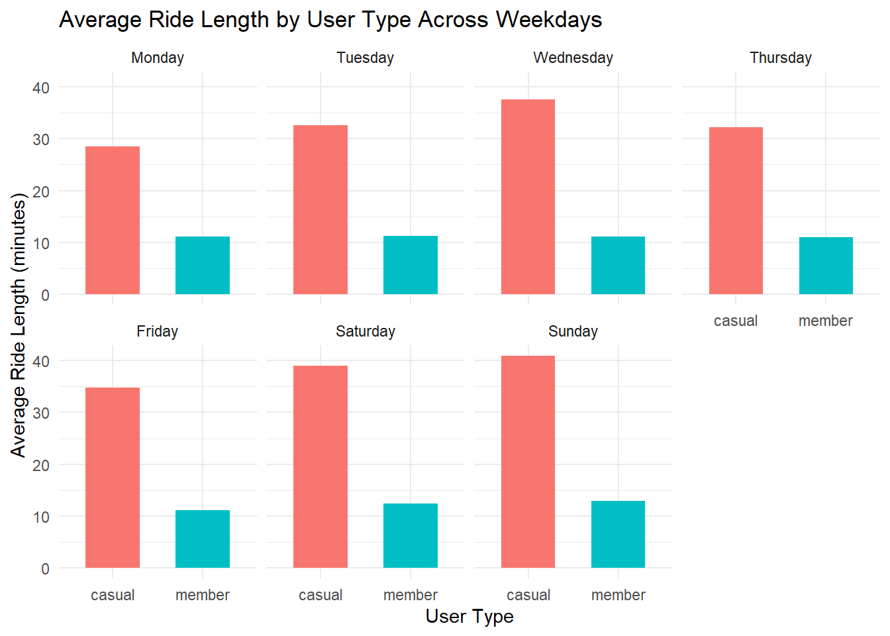

# Divvy Bike Case Study (2019–2020 Q1)

## Project Overview
This case study analyzes bike usage patterns using data from Divvy, a bike-sharing service in Chicago. The data comes from 2019 Q1 and 2020 Q1 datasets provided by Motivate International Inc.  

We aim to understand how **member users** and **casual users** differ in their riding behavior.

## Data Cleaning
- Merged 2019 and 2020 datasets into one table.
- Standardized column names and formats.
- Removed anomalous rides longer than 24 hours.
- Unified user type values: `member` vs `casual`.

## Descriptive Statistics
- **Overall ride length:** Mean = 13.66 min, Max = 1435.92 min, Most common day = Tuesday.
- **By user type:**  
  - Casual users ride longer on weekends.  
  - Member users ride more frequently on weekdays.
- **Year-over-year:**  
  - Casual users’ average ride length: 35.3 min (2019), 36.9 min (2020)  
  - Member users’ average ride length: 11.3 min (2019), 11.5 min (2020)

## Visualizations
1. **Average Ride Duration by User Type (2019 vs 2020 Q1)**  
   

2. **Average Ride Length Across Weekdays**  
   

3. **Number of Rides by Day of Week and User Type**  
   

## Key Insights
- Casual users ride longer but less frequently than members.  
- Members ride primarily on weekdays, casual users on weekends.  
- Average ride length is consistent year over year for both groups.

## How to Explore the Analysis
- Open `Divvy_Case_Study.html` to view the full analysis with tables, code, and visualizations.
